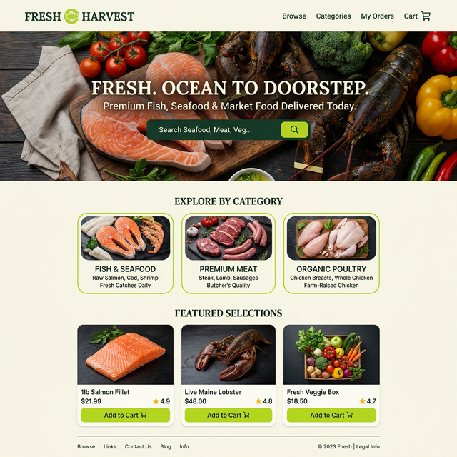
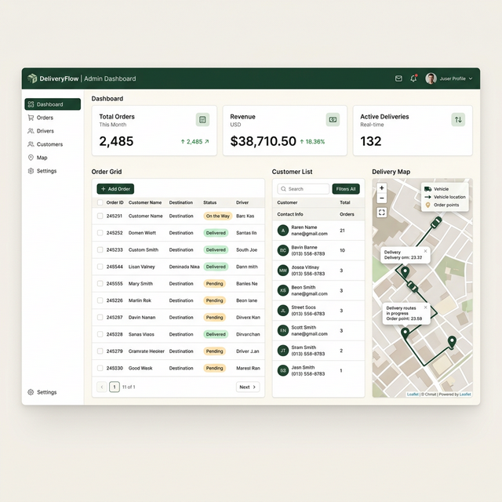
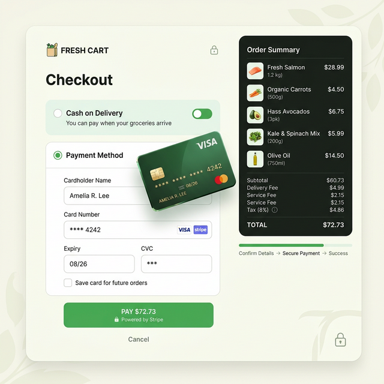

# 🐟 Fresh Delivery App

A premium, full-stack delivery application designed for artisanal food suppliers. Built with **React**, **Node.js**, and **Supabase**, featuring a seamless shopping experience and a robust admin management system.

---

## 🌟 Features

### 🛒 Customer Experience
- **Dynamic Product Discovery**: Browse fresh fish, prime meats, and organic groceries with ease.
- **Real-time Cart Management**: Add items, update quantities, and see instant price calculations.
- **Secure Checkout**: Integrated with **Stripe** for bank-grade card payments, with support for **Cash on Delivery (COD)**.
- **Responsive Design**: Beautifully optimized for both desktop and mobile users.
- **Delivery Banners**: Smart notifications for delivery slots and promotional offers.

### 🛡️ Admin Panel (RBAC)
- **Order Management**: Track and manage orders from placement to delivery with status updates.
- **Customer Insights**: Detailed view of customer history and preferences.
- **Product Control**: Easily add, update, or remove items from the marketplace.
- **Delivery Logistics**: Interactive map view using **Leaflet** to visualize delivery routes and order locations.
- **Data Export**: Export customer and order data to CSV for reporting.

---

## 🖼️ Screenshots

<div align="center">
  <h3>Landing Page</h3>
  
  <br><br>
  <h3>Admin Dashboard</h3>
  
  <br><br>
  <h3>Secure Checkout</h3>
  
</div>

---

## 🛠️ Tech Stack

**Frontend:**
- [React.js](https://reactjs.org/) - UI Library
- [Vite](https://vitejs.dev/) - Build Tool
- [Firebase Auth](https://firebase.google.com/docs/auth) - User Authentication
- [Leaflet](https://leafletjs.com/) - Interactive Maps
- [Stripe Elements](https://stripe.com/docs/stripe-js/react) - Payment Integration

**Backend:**
- [Node.js](https://nodejs.org/) & [Express](https://expressjs.com/) - Application Server
- [Supabase](https://supabase.com/) - PostgreSQL Database & Client
- [Firebase Admin](https://firebase.google.com/docs/admin) - Secure Backend Operations
- [Stripe SDK](https://stripe.com/docs/api) - Server-side Payment Processing

---

## 🚀 Getting Started

### Prerequisites
- Node.js (v18+)
- Firebase Account
- Supabase Account
- Stripe API Keys

### Installation

1. **Clone the repository:**
   ```bash
   git clone https://github.com/charl5sgithub/delivery-app.git
   cd delivery-app
   ```

2. **Backend Setup:**
   ```bash
   cd backend
   npm install
   # Create a .env file based on .env.example
   npm run dev
   ```

3. **Frontend Setup:**
   ```bash
   cd ../frontend
   npm install
   # Create a .env file based on .env.example
   npm run dev
   ```

### 📦 Seeding Data
To populate the database with initial products:
```bash
cd backend
npm run seed
```

---

## 📄 License
This project is licensed under the ISC License.
